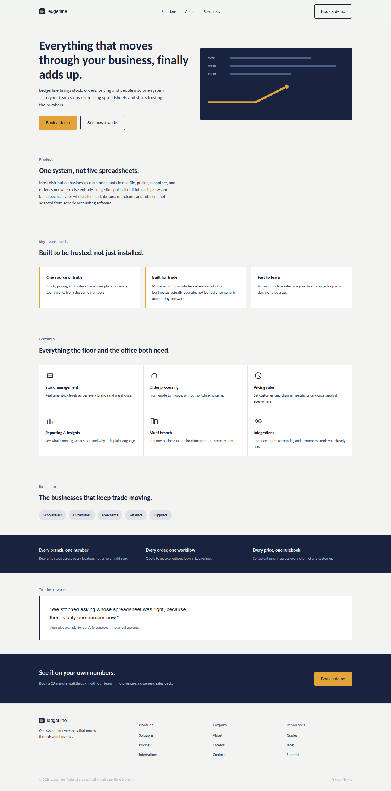
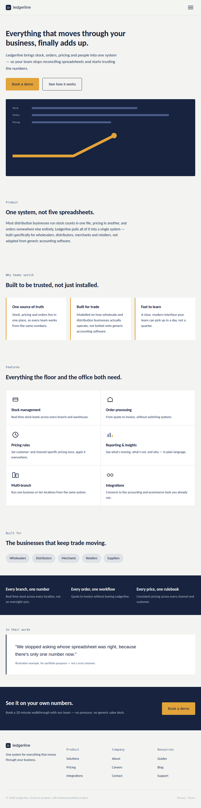
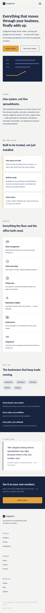
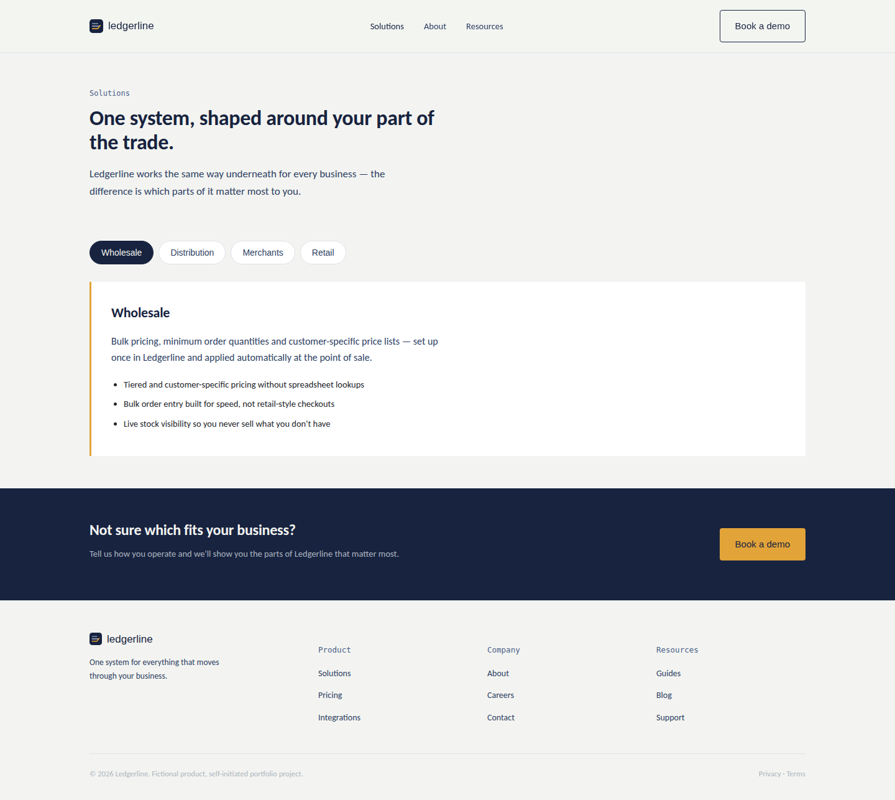
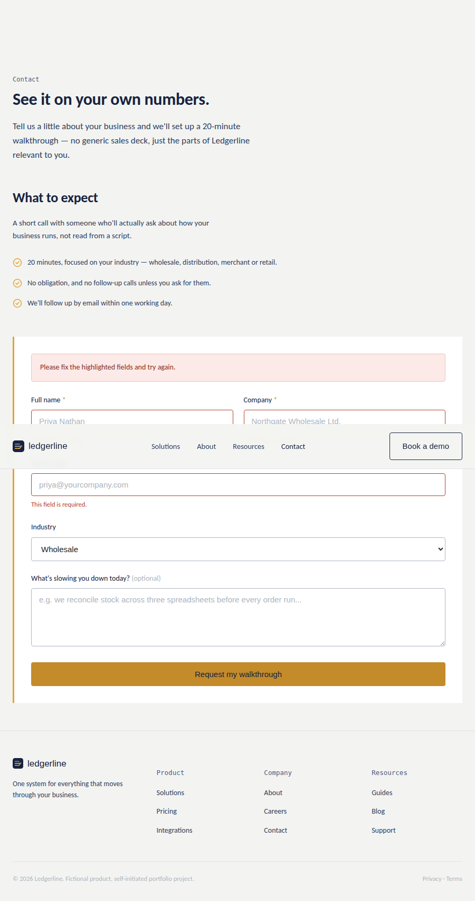
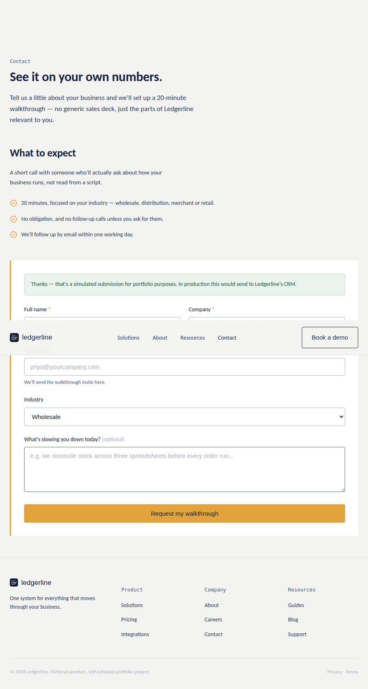

# Ledgerline — Brand & Digital Design Project

**A self-initiated portfolio project exploring brand strategy, visual identity, campaign design, UX/UI, and responsive web development.**

> **Disclaimer:** Ledgerline is a fictional company and product created entirely for this portfolio project. It was not commissioned by, produced for, or developed in partnership with any real company. All business, product, customer, and performance details are fictional.

**[Read the full case study →](./case-study/case-study.md)**

---

## Overview

Ledgerline is a fictional B2B ERP platform created for businesses in wholesale and distribution.

The project explores what happens when a digital product brand is developed as a complete system rather than as a collection of isolated design pieces.

The work spans:

**Strategy → Brand Identity → Campaign → UX → UI → Web Development → Documentation**

The project was designed as a self-directed portfolio exercise around the skill set expected of a modern Brand & Digital Designer, combining traditional visual design with hands-on digital implementation.

### Positioning

> For operations leaders in wholesale and distribution who are tired of clunky, outdated software, Ledgerline is the ERP platform that feels as fast and clear as the business it runs — unlike legacy systems that slow teams down.

The brand personality is built around four characteristics:

**Reliable · Direct · Modern · Human**

---

## Objective

The objective was to take a fictional B2B software company from an initial strategic concept through to a complete and functioning digital presence.

Rather than producing unrelated portfolio pieces, the project was structured so that each stage informed the next:

* Strategy informed the brand identity
* Brand identity informed the campaign
* Research informed the UX
* UX informed the interface
* The interface was translated into working code
* The final implementation was documented for handoff

The result is a single, connected project demonstrating the relationship between **design thinking, visual communication, and digital execution**.

---

## Tools & Technology

### Brand & Campaign

* SVG
* HTML/CSS
* Vector-based design
* Responsive layouts

### Print

* HTML
* CSS
* PDF production workflow
* A4 print layout

### UI Design

* HTML
* CSS
* Responsive breakpoints
* Desktop, tablet, and mobile layouts

### Front End

* Semantic HTML5
* CSS3
* CSS custom properties
* Vanilla JavaScript
* Client-side form validation

### Typography

* Space Grotesk — display
* IBM Plex Sans — body/UI
* IBM Plex Mono — metadata/labels

### Tooling Note

The project was developed in a code-first environment without direct access to Adobe Creative Suite or Figma.

As a result, design deliverables that would traditionally be produced in Illustrator, Photoshop, InDesign, or Figma were instead developed using vector SVG, HTML, and CSS.

This means the project demonstrates the underlying design and production skills — including vector construction, typography, layout, responsive design, visual hierarchy, and print composition — but does **not** claim to demonstrate proficiency in the specific Adobe or Figma applications themselves.

That distinction is intentional and documented for transparency.

---

## Design Process

### 01 — Strategy

Positioning, audience definition, brand personality, and tone of voice.

### 02 — Brand Identity

Logo, colour system, typography, iconography, imagery direction, and brand guidelines.

### 03 — Campaign

Creative brief, campaign concept, headline development, copy, and multi-format campaign assets.

### 04 — UX

Personas, user journey, information architecture, sitemap, and low-fidelity wireframes.

### 05 — UI

High-fidelity responsive interface design covering the homepage and two inner pages.

### 06 — Development

Working HTML/CSS/JavaScript implementation with responsive behaviour and interactive form states.

### 07 — Documentation

Brand guidelines, developer handoff documentation, case study, and project structure.

---

## Deliverables

| Folder             | Contents                                                                   |
| ------------------ | -------------------------------------------------------------------------- |
| `/brand`           | Logo suite, SVG assets, and complete brand guidelines                      |
| `/creative-brief`  | Campaign creative brief                                                    |
| `/campaign`        | Social, digital advertising, email, website banner, and promotional assets |
| `/print`           | A4 brochure source, print-ready PDF, and presentation cover                |
| `/research`        | Personas and primary user journey                                          |
| `/ux`              | Information architecture, sitemap, and low-fidelity wireframes             |
| `/ui-design`       | High-fidelity responsive screens and exports                               |
| `/web-development` | Working homepage, Solutions page, Contact/demo page, CSS, and JavaScript   |
| `/documentation`   | Developer handoff specification                                            |
| `/case-study`      | Full project case study                                                    |

---

## Screenshots

### Homepage — Desktop



### Homepage — Tablet & Mobile

 

### Solutions — Industry Tabs



### Contact — Form Validation

 

---

## What the Project Demonstrates

### Brand & Visual Design

* Brand identity development
* Logo and icon systems
* Typography
* Colour systems
* Layout and visual hierarchy
* Brand guidelines

### Campaign Design

* Creative direction
* Campaign concept development
* Marketing graphics
* Social media assets
* Digital advertising
* Email graphics
* Print collateral

### UX/UI

* Persona development
* User journeys
* Information architecture
* Wireframing
* Responsive interface design
* Interaction states
* Usability refinement

### Web Development

* Semantic HTML
* Responsive CSS
* CSS custom properties
* Vanilla JavaScript
* Client-side form validation
* Interactive states
* Mobile-first implementation

### Documentation

* Brand guidelines
* Design-system documentation
* Developer handoff
* Implementation notes
* Project organisation

---

## A Usability Issue Caught During Development

One of the more useful discoveries happened during implementation rather than during the initial design phase.

At approximately 20–22px, the standalone Ledgerline logo mark could visually resemble a hamburger menu icon when positioned beside the actual navigation control on mobile.

Rather than accepting the issue because the logo looked correct in isolation, the navigation-context version of the logo was changed to a badge variant with the mark contained inside a rounded square.

It is a small change, but it demonstrates an important part of the process: **design decisions were evaluated in their actual interface context, not only as isolated assets.**

The full reasoning is documented in the case study.

---

## Development

The website consists of three responsive pages:

* **Homepage**
* **Solutions**
* **Contact / Demo**

The pages share a common CSS and JavaScript foundation.

The implementation uses CSS custom properties to carry the brand's colour, typography, spacing, and interface values directly into the coded experience.

The contact form includes:

* Required-field validation
* Email validation
* Visible error states
* Success states
* User feedback

Because Ledgerline is fictional, the form does not connect to a real CRM or pretend to submit real customer information. The successful submission state is explicitly presented as simulated.

---

## Developer Handoff

A dedicated developer handoff document explains how the visual system can be maintained and extended.

It covers:

* Colour tokens
* Typography
* Spacing scale
* Button states
* Form states
* Responsive breakpoints
* Component behaviour
* Implementation considerations
* Potential React component structure

Documentation:

`/documentation/developer-handoff.html`

---

## Project Structure

```text
ledgerline/
│
├── brand/
│   ├── logo/
│   └── brand-guidelines.html
│
├── research/
│   └── personas-journey.html
│
├── ux/
│   └── wireframes/
│
├── ui-design/
│   └── exports/
│
├── creative-brief/
│
├── campaign/
│
├── print/
│
├── web-development/
│   ├── index.html
│   ├── solutions.html
│   ├── contact.html
│   ├── styles.css
│   └── script.js
│
├── documentation/
│   └── developer-handoff.html
│
└── case-study/
    └── case-study.md
```

---

## Project Outcome

Ledgerline is a fictional project, so no real business results are claimed.

There are no fabricated:

* Conversion rates
* Website traffic figures
* Customer testimonials
* Revenue figures
* Product adoption metrics
* Client results

The outcome is the completed system itself: a fictional B2B software brand developed from strategy through to a working responsive digital experience.

The project demonstrates the ability to maintain a consistent design direction across multiple stages and formats while making practical decisions during implementation.

---

## Limitations

As a self-initiated fictional project, Ledgerline cannot demonstrate every aspect of professional client work.

It does not demonstrate:

* Working with real stakeholders
* Managing live client feedback
* Resolving conflicting stakeholder requirements
* Working within an established corporate brand
* Using an existing CMS
* Working within a production development pipeline
* Conducting primary research with real users
* Delivering against live commercial deadlines
* Measuring real business outcomes
* Professional proficiency in Adobe Creative Suite or Figma

These limitations are intentionally disclosed rather than hidden.

The project is intended to demonstrate **process, design thinking, execution, technical implementation, and the ability to carry a concept through multiple mediums**.

---

## Why I Built It

I wanted to explore the full journey of a digital brand rather than demonstrate one isolated skill.

Ledgerline allowed me to work across strategy, identity, campaign design, UX, UI, responsive web development, and documentation within one connected project.

The most valuable part was seeing how decisions changed once the work moved from static design into a real interface.

The project ultimately became an exercise in maintaining one coherent idea across **brand, communication, experience, and implementation**.

---

**Self-initiated portfolio project. Ledgerline is entirely fictional and is not affiliated with any real company.**
